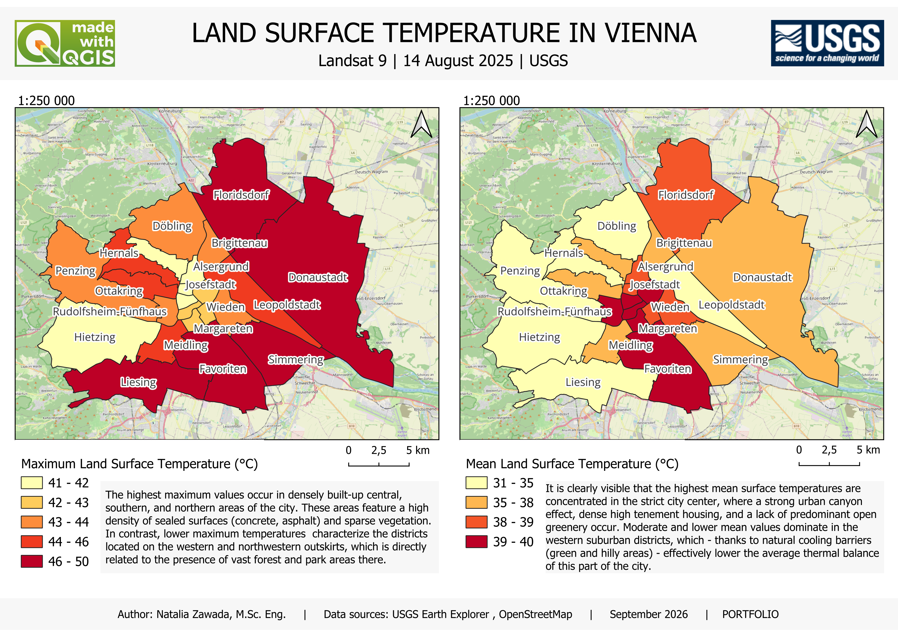

# Vienna Land Surface Temperature

## Project overview

This project presents a Land Surface Temperature (LST) analysis of Vienna, Austria, using Landsat 9 satellite imagery and QGIS.

The aim of the analysis was to identify spatial differences in land surface temperature across the 23 districts of Vienna.

## Data

* **Satellite:** Landsat 9
* **Acquisition date:** 14 August 2025
* **Product:** Landsat Collection 2 Level-2
* **Data source:** USGS EarthExplorer
* **Spatial resolution:** 30 m
* **Study area:** Vienna, Austria

## Methodology

The analysis was performed in QGIS using the following workflow:

1. Downloading Landsat 9 Level-2 Surface Temperature data.
2. Converting the Landsat 9 ST_B10 band values to Land Surface Temperature (LST) in degrees Celsius using the USGS scale factor and offset.
3. Creating a Vienna district boundary layer.
4. Clipping the LST raster to the study area.
5. Calculating zonal statistics for the 23 districts of Vienna.
6. Calculating mean and maximum LST for each district.
7. Creating thematic maps showing the spatial distribution of surface temperature.

## Results

The final maps show spatial variation in Land Surface Temperature across Vienna.

Two indicators were analysed:

* **Mean LST (°C)** — average surface temperature within each district.
* **Maximum LST (°C)** — highest recorded surface temperature within each district.

## Map

## Tools

* QGIS
* Landsat 9
* USGS EarthExplorer

## Note

Land Surface Temperature represents the temperature of the Earth's surface and should not be interpreted as air temperature.
